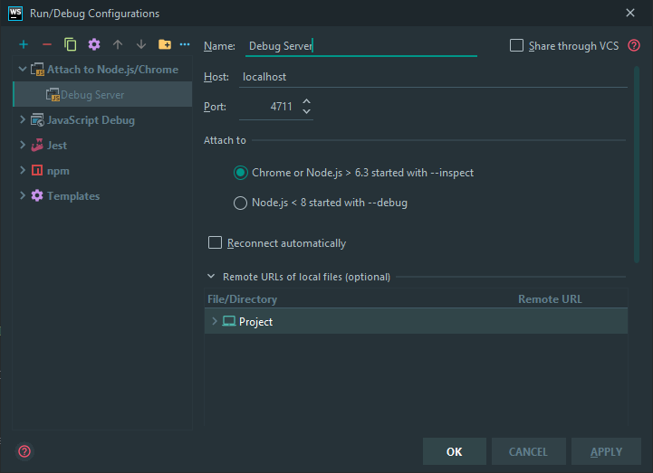

[](https://travis-ci.org/afluegge/haisl-manager)
[](https://coveralls.io/github/afluegge/haisl-manager?branch=master)
# HaislManager

`haisl-manager` is a vacation home manager that allows to manage multiple vacation homes.  It allows to manage vacation homes
 from different clients.  `haisl-manager` not only manages the presentation of the vacation home, it also allows to keep
 track of the comercial part of house management.
 
 ## Building Blocks

### User Management


### Client Management


### Occupation Calendar


### Rental Management


### Image Management


### Web-Site Management


##Implementation Notes

### Debugging the NestJS Application

To be able to debug the NestJS Application we need to run the Node Server that hosts the NestJS application in
debug mode.  It is important to suspend NodeJS immediatly after start to be able to debug application startup code.
This is done by starting the Node server with the command line option `inspect-brk`.  Optionally one can also
specify the port on which the Chrome V8 engines debug service will listen wit command line option `port`.

These settings must be done in the `angular.json` file.  See the angular.json file of this project for reference 
(namely the definitions for the `serve` command of the `api` library project):

```json
"serve": {
    "builder": "@nrwl/node:execute",
    "options": {
        "buildTarget": "api:build",
        "inspect": "inspect-brk",
        "port": 4711
    }
}
```

To disable debugging, remove the `inspect` and `port` settings.

Once these settings are done, everytime on calls `ng serve` the NestJS application starts up in debug mode, immediatly 
suspends and waits for a debug client to attach.  The debug client will be the Webstorm IDE.

#### Setting up a debug run configuration in Webstorm


